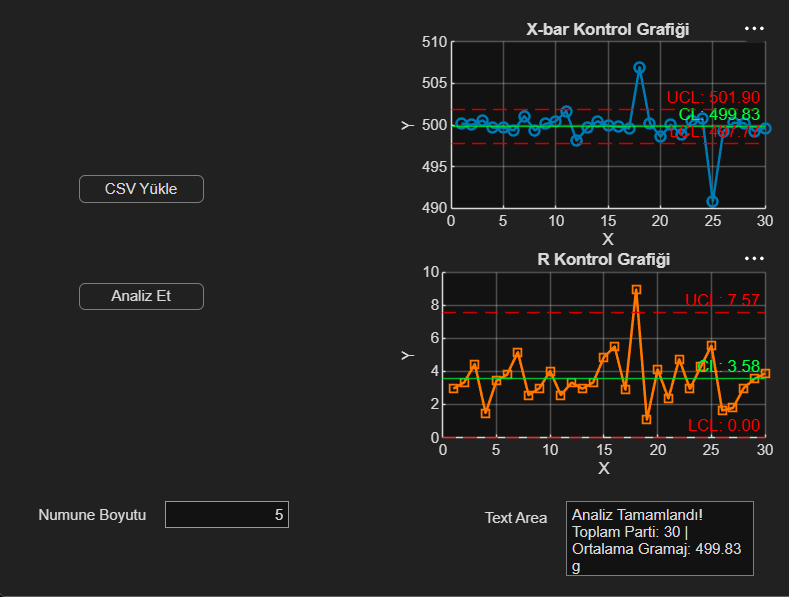

# Statistical Process Control (SPC) Quality Dashboard

An interactive MATLAB App Designer application for Statistical Process Control (SPC) in industrial manufacturing lines. It monitors quality using Shewhart control charts ($\bar{X}$ and $R$ charts).

## Application Interface

## Features

* Interactive GUI created with MATLAB App Designer
* Automatic $\bar{X}$ and $R$ control chart generation
* ASTM factor calculations ($n=5$)
* Real-time out-of-control point detection and summary report

## How to Run

1. Open MATLAB.
2. Run `spc_app.mlapp`.
3. Click **CSV Yükle** and select `dolum_verisi.csv`.
4. Click **Analiz Et** to view the charts.
